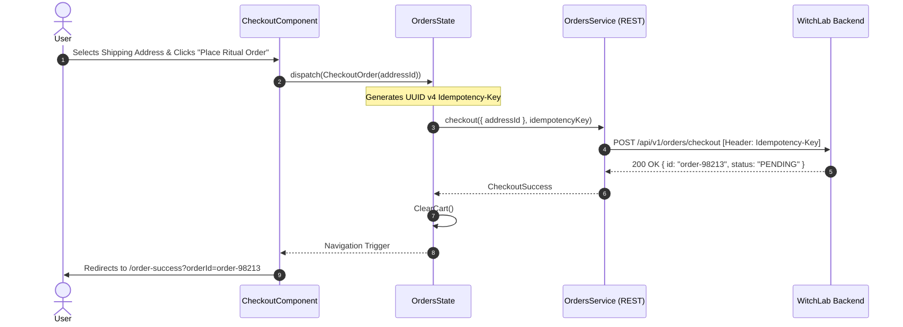
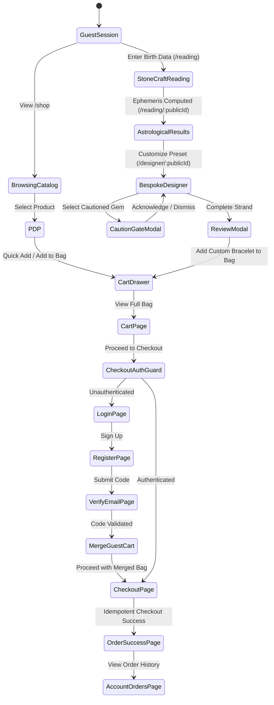

# Full WitchLab Ecommerce Product Flow & UX Documentation

> **Document Type:** Production Architecture, Product Flow & UX Specification  
> **Source Repository:** `witchlab/wls-f`  
> **Framework & Engine:** Angular 21.2 (Standalone, SSR / Hydration, NGXS 21, Apollo GraphQL, REST)  
> **Styling & Tokens:** Tailwind CSS v4, Custom Design Tokens, Google Fonts & Local Web Fonts  
> **Status:** Fully Reverse-Engineered from Source Code  

---

## Table of Contents

1. [Executive Project Overview](#1-executive-project-overview)
2. [System & Frontend Architecture](#2-system--frontend-architecture)
3. [Full Sitemap and Routing Blueprint](#3-full-sitemap-and-routing-blueprint)
4. [Global Layout & App Shell](#4-global-layout--app-shell)
5. [Global Header & Navigation System](#5-global-header--navigation-system)
6. [Global Footer Architecture](#6-global-footer-architecture)
7. [Comprehensive Page-by-Page Documentation](#7-comprehensive-page-by-page-documentation)
   - 7.1 [Homepage (`/`)](#71-homepage-)
   - 7.2 [Shop Catalog (`/shop`)](#72-shop-catalog-shop)
   - 7.3 [Product Detail Page (`/product/:slug`)](#73-product-detail-page-productslug)
   - 7.4 [Search Page (`/search`)](#74-search-page-search)
   - 7.5 [Our Story / About Page (`/about`)](#75-our-story--about-page-about)
   - 7.6 [FAQ Page (`/faq`)](#76-faq-page-faq)
   - 7.7 [Contact Page (`/contact`)](#77-contact-page-contact)
   - 7.8 [Ritual Bag / Cart Page (`/cart`)](#78-ritual-bag--cart-page-cart)
   - 7.9 [Checkout Page (`/checkout`)](#79-checkout-page-checkout)
   - 7.10 [Order Success Page (`/order-success`)](#710-order-success-page-order-success)
   - 7.11 [Authentication: Log In (`/login`)](#711-authentication-log-in-login)
   - 7.12 [Authentication: Sign Up (`/register`)](#712-authentication-sign-up-register)
   - 7.13 [Authentication: Verify Email (`/verify-email`)](#713-authentication-verify-email-verify-email)
   - 7.14 [Authentication: Forgot Password (`/forgot-password`)](#714-authentication-forgot-password-forgot-password)
   - 7.15 [Authentication: Reset Password (`/reset-password`)](#715-authentication-reset-password-reset-password)
   - 7.16 [Account: Overview (`/account`)](#716-account-overview-account)
   - 7.17 [Account: Order History (`/account/orders`)](#717-account-order-history-accountorders)
   - 7.18 [Account: Shipping Addresses (`/account/addresses`)](#718-account-shipping-addresses-accountaddresses)
   - 7.19 [Account: Personal Details (`/account/details`)](#719-account-personal-details-accountdetails)
   - 7.20 [Account: Security & Danger Zone (`/account/security`)](#720-account-security--danger-zone-accountsecurity)
   - 7.21 [StoneCraft: Astrological Reading Input (`/reading`)](#721-stonecraft-astrological-reading-input-reading)
   - 7.22 [StoneCraft: Astrological Reading Result (`/reading/:publicId`)](#722-stonecraft-astrological-reading-result-readingpublicid)
   - 7.23 [StoneCraft: Shared Reading Result (`/shared/:shareToken`)](#723-stonecraft-shared-reading-result-sharedsharetoken)
   - 7.24 [StoneCraft: Bespoke Bracelet Designer (`/designer/:publicId`)](#724-stonecraft-bespoke-bracelet-designer-designerpublicid)
   - 7.25 [StoneCraft: My Saved Bracelets (`/bracelets`)](#725-stonecraft-my-saved-bracelets-bracelets)
8. [Micro-Component & Interactive Widget Deep Dive](#8-micro-component--interactive-widget-deep-dive)
9. [Complete Button, Link & Navigation Flow Matrix](#9-complete-button-link--navigation-flow-matrix)
10. [End-to-End User Journeys (Personas & Flows)](#10-end-to-end-user-journeys-personas--flows)
11. [Shopping Bag & Cart Lifecycle](#11-shopping-bag--cart-lifecycle)
12. [Checkout & Idempotent Order Placement Engine](#12-checkout--idempotent-order-placement-engine)
13. [Authentication & Concurrency-Safe Session Lifecycle](#13-authentication--concurrency-safe-session-lifecycle)
14. [Account & Customer Profile Management](#14-account--customer-profile-management)
15. [Search, Ranking, Filtering & Sorting System](#15-search-ranking-filtering--sorting-system)
16. [Astrological StoneCraft & Bespoke Talisman Engine](#16-astrological-stonecraft--bespoke-talisman-engine)
17. [State Management Architecture (NGXS + Local Signal Stores)](#17-state-management-architecture-ngxs--local-signal-stores)
18. [API, GraphQL & Network Transport Pipeline](#18-api-graphql--network-transport-pipeline)
19. [UI States, Modal Windows & Interactive Overlays](#19-ui-states-modal-windows--interactive-overlays)
20. [Responsive Strategy & Breakpoint Behavior](#20-responsive-strategy--breakpoint-behavior)
21. [Internationalization (i18n) & Multi-Language Infrastructure](#21-internationalization-i18n--multi-language-infrastructure)
22. [Design System Tokens, Typography & Aesthetics](#22-design-system-tokens-typography--aesthetics)
23. [Reusable UX & Ergonomic Patterns](#23-reusable-ux--ergonomic-patterns)
24. [Interaction Matrix & Transition State Machine](#24-interaction-matrix--transition-state-machine)
25. [Implementation Gaps, Edge Cases & Behavioral Notes](#25-implementation-gaps-edge-cases--behavioral-notes)

---

## 1. Executive Project Overview

**WitchLab** is an artisanal, luxury botanical and talisman ecommerce platform intertwined with a bespoke astronomical/astrological talisman configuration engine known as **StoneCraft**. The application bridges occult and high-end botanical apothecary goods (candles, elixirs, ritual oils, tarot) with computational celestial mechanics (Swiss Ephemeris-backed gemstone prescription and algorithmic bead rope strand solver).

### Brand Narrative & Product Positioning
- **The Atelier Philosophy:** Products are treated as consecrated ritual objects rather than mass-market consumables.
- **Dual Catalog Paradigm:** 
  1. *Standard Atelier Catalog:* Traditional ecommerce merchandise, categorized by occult Intention (Protection, Love, Wealth, Intuition) and Category (Candles, Elixirs, Tools).
  2. *StoneCraft Bespoke Talismans:* Astrologically personalized gemstone bracelets formulated through exact natal coordinates, planetary strengths/debilities, and planetary ruler gemstones, followed by interactive bead-by-bead physical strand design.

---

## 2. System & Frontend Architecture

### Core Tech Stack
- **Framework:** Angular 21.2.0 (Standalone Components, Native Signals, Signal Inputs/Queries, Control Flow `@if` / `@for` / `@switch`).
- **Rendering Architecture:** Hybrid SSR (Server-Side Rendering via `@angular/ssr` with Client Hydration).
  - *Server Rendered Routes:* Public catalog (`/`, `/shop`, `/product/:slug`, `/about`, `/faq`, `/contact`, `/shared/:shareToken`).
  - *Client Only Routes (`RenderMode.Client`):* Birth data privacy routes (`/reading`, `/reading/:publicId`, `/designer`, `/designer/:publicId`, `/bracelets`) ensuring sensitive natal coordinates never transit the Node.js SSR server process.
- **State Management:**
  - *Global Store:* NGXS (`@ngxs/store` 21.0.0) handling `AuthState`, `CartState`, `OrdersState`, `ProfileState`, `ProductsState`, `CategoriesState`, `IntentionsState`.
  - *Local Reactive Stores:* Angular Signals & Service-with-Signals (`ReadingStore`, `BraceletDesignStore`, `PlaceLookupService`, `SavedBraceletsService`).
- **Data Layer:**
  - *GraphQL:* Apollo Angular (`apollo-angular`, `@apollo/client`, GraphQL Code Generator for strongly-typed GraphQL operations).
  - *REST:* Angular `HttpClient` with custom interceptors (`ApiInterceptor`, `RefreshInterceptor`, `ErrorInterceptor`).
- **Internationalization:** `@ngx-translate/core` with JSON translation tables supporting English (`en`), Georgian (`ka`), and Russian (`ru`).
- **Styling:** Tailwind CSS v4 (`@tailwindcss/postcss`) with CSS variables defining the atelier color palette, custom typography scales, and responsive layout utilities.
- **Third-Party Integrations:**
  - Social Auth: `@abacritt/angularx-social-login` (Google OneTap & Apple Login).
  - Geocoding: GeoNames dataset (~1.1MB compressed in-browser search index for birth place lookup).
  - Masking & Parsing: `ngx-mask`, `libphonenumber-js`.

---

## 3. Full Sitemap and Routing Blueprint

All application routes are defined inside `src/app/app.routes.ts` and encapsulated within `RootLayoutComponent`.

```mermaid
graph TD
    Root["Root Layout (app.routes.ts)"]
    
    %% Public Routes
    Root --> Home["/ (HomeComponent)"]
    Root --> Shop["/shop (ShopComponent)"]
    Root --> PDP["/product/:slug (ProductDetailComponent)"]
    Root --> Search["/search (SearchComponent)"]
    Root --> About["/about (AboutComponent)"]
    Root --> FAQ["/faq (FaqComponent)"]
    Root --> Contact["/contact (ContactComponent)"]
    
    %% Cart & Checkout
    Root --> Cart["/cart (CartPageComponent)"]
    Root --> Checkout["/checkout (CheckoutComponent) [authGuard]"]
    Root --> Success["/order-success (OrderSuccessComponent)"]
    
    %% Auth
    Root --> Login["/login (LoginComponent) [guestGuard]"]
    Root --> Register["/register (RegisterComponent) [guestGuard]"]
    Root --> Verify["/verify-email (VerifyEmailComponent) [guestGuard]"]
    Root --> Forgot["/forgot-password (ForgotPasswordComponent) [guestGuard]"]
    Root --> Reset["/reset-password (ResetPasswordComponent) [guestGuard]"]
    
    %% Account
    Root --> Account["/account (AccountLayoutComponent) [authGuard]"]
    Account --> AccOverview["/account (AccountOverviewComponent)"]
    Account --> AccOrders["/account/orders (AccountOrdersComponent)"]
    Account --> AccAddresses["/account/addresses (AccountAddressesComponent)"]
    Account --> AccDetails["/account/details (AccountDetailsComponent)"]
    Account --> AccSecurity["/account/security (AccountSecurityComponent)"]
    
    %% StoneCraft
    Root --> SCReadingInput["/reading (BirthInputPage)"]
    Root --> SCReadingResult["/reading/:publicId (ReadingPage)"]
    Root --> SCSharedReading["/shared/:shareToken (SharedReadingPage)"]
    Root --> SCDesigner["/designer (DesignerRedirectGuard)"]
    Root --> SCDesignerId["/designer/:publicId (DesignerPage)"]
    Root --> SCBracelets["/bracelets (MyBraceletsPageComponent)"]
```



### Route Guard Specifications
1. **`authGuard` (`src/app/core/guards/auth.guard.ts`):**
   - Waits for `AppInitService.ready$` to ensure auth token restoration is complete.
   - Verifies `AuthSelectors.isAuthenticated`.
   - If unauthenticated: redirects to `/login?returnUrl=<attempted_url>`.
   - Protects: `/checkout`, `/account`, `/account/*`.
2. **`guestGuard` (`src/app/core/guards/guest.guard.ts`):**
   - Waits for `AppInitService.ready$`.
   - Checks `AuthSelectors.isAuthenticated`.
   - If authenticated: redirects to `/`.
   - Protects: `/login`, `/register`, `/verify-email`, `/forgot-password`, `/reset-password`.
3. **`DesignerRedirectGuard` (`src/app/features/stonecraft.routes.ts`):**
   - Inspects `LastReadingService.publicId()`.
   - If a valid UUID v4 reading exists: redirects to `/designer/:publicId`.
   - If no reading exists: redirects to `/reading`.

---

## 4. Global Layout & App Shell

The application is framed by `RootLayoutComponent` (`src/app/layout/root-layout/root-layout.component.ts`).

### Shell Elements
- **Header Component (`<app-header>`):** Sticky top navigational bar with dynamic scroll compaction.
- **Main Viewport (`<router-outlet>`):** Fluid container executing route component rendering.
- **Footer Component (`<app-footer>`):** Global bottom navigation, brand philosophy, and locale switchers.
- **Global Overlays & Modals:**
  - `<app-cart-drawer>`: Global slide-over bag triggered from header icon, quick-adds, or designer.
  - `<app-search-modal>`: Global search backdrop triggered by search icons or mobile menu.
  - `<app-mobile-menu>`: Full-screen mobile navigation drawer.
  - `<app-toast-container>`: Notification toast stack (top-right desktop, top-center mobile).

---

## 5. Global Header & Navigation System

Component: `HeaderComponent` (`src/app/layout/header/header.component.ts`)

```
+-----------------------------------------------------------------------------------------------+
| Announcement Bar: ✦ BESPOKE TALISMAN DESIGNER • CRAFT YOUR ASTROLOGICAL BRACELET [Explore Now] |
+-----------------------------------------------------------------------------------------------+
| [WITCHLAB LOGO]    Catalog   Intentions   Our Story   FAQ    |  [Search]  [Lang: EN]  [User] [Bag(3)] |
+-----------------------------------------------------------------------------------------------+
```

### Functional Features
1. **Announcement Bar:**
   - Gold/green contrasting top ribbon with direct link to `/reading`.
2. **Dynamic Scroll Compression:**
   - Detects `window.scrollY > 20px` via `HostListener('window:scroll')`.
   - Smoothly transitions header height from `h-20` (80px) to `h-16` (64px) with subtle border shadow.
3. **Navigation Links:**
   - Desktop: Catalog (`/shop`), Intentions dropdown / tabs, Our Story (`/about`), FAQ (`/faq`), Contact (`/contact`).
   - Mobile: Hamburger button triggering `<app-mobile-menu>`.
4. **Language Selector Dropdown:**
   - Switches between `en` (English), `ka` (ქართული), and `ru` (Русский).
   - Triggers `LocaleService.setLocale()`, updating HTML `lang` attributes, `@ngx-translate`, and Apollo GraphQL HTTP request headers.
5. **Account Entry Point:**
   - Authenticated: Shows user avatar / initial, directs to `/account`.
   - Guest: Directs to `/login`.
6. **Ritual Bag Drawer Trigger:**
   - Displays real-time badge count from `CartSelectors.totalCount`.
   - Opens `<app-cart-drawer>` on click without leaving current page.

---

## 6. Global Footer Architecture

Component: `FooterComponent` (`src/app/layout/footer/footer.component.ts`)

### Structure & Sections
1. **Column 1 — Atelier Philosophy:** Brand mark, mission statement, artisanal lunar crafting principles.
2. **Column 2 — Collections & Craft:** Direct links to `/shop`, `/reading`, `/bracelets`, `/shop?category=candles`, `/shop?category=elixirs`.
3. **Column 3 — Circle & Initiate:** Links to `/account`, `/account/orders`, `/account/addresses`, `/login`, `/register`.
4. **Column 4 — Sanctuary & Guidance:** Links to `/about`, `/faq`, `/contact`, studio location (Tbilisi, Georgia).
5. **Bottom Bar:** Copyright notice, currency disclosure (GEL - Georgian Lari), localized legal links.

---

## 7. Comprehensive Page-by-Page Documentation

### 7.1 Homepage (`/`)
- **Component:** `HomeComponent` (`src/app/features/home/home.component.ts`)
- **Sections:**
  1. *Hero Editorial Section:* Rotating 3-slide visual carousel with Sinistre serif typography, direct links to `/shop` and `/reading`.
  2. *Popular Products Carousel (`<app-popular-products-section>`):* Horizontal swipeable product carousel with wishlist toggling and quick add-to-bag.
  3. *Featured Categories Portal (`<app-featured-categories-section>`):* 3-column split card display featuring Roman numerals (I, II, III) and editorial imagery.
  4. *StoneCraft Bespoke Banner (`<app-custom-bracelet-section>`):* Highlight card introducing the astrological talisman generator.
  5. *Best Sellers Grid:* 4-column product grid populated via GraphQL `GetBestSellerProducts`.
  6. *Intention Shop Section:* Tabbed product showcase filtering by Intention (Protection, Love, Intuition, Abundance).
  7. *Artisanal Pillars:* 3 craft manifesto pillars (Ethical Botanical Foraging, Lunar Consecration, Master Goldsmithing).
  8. *Newsletter Subscription:* Email input with validation and localized confirmation feedback.

### 7.2 Shop Catalog (`/shop`)
- **Component:** `ShopComponent` (`src/app/features/shop/shop.component.ts`)
- **Layout:** 2-column layout (Desktop: Left filter sidebar 3 cols, Right product grid 9 cols. Mobile: Sticky bottom filter button triggering slide-up drawer).
- **Filtering Capabilities:**
  - *Category Filter:* Checkbox list populated from `CategoriesState`.
  - *Intention Filter:* Checkbox list populated from `IntentionsState`.
  - *Zodiac Alignment:* Dropdown for 12 astrological signs.
  - *Price Range:* Min / Max numeric inputs with instant debounce.
  - *Sorting:* Featured (default), Price Low to High (`price_asc`), Price High to Low (`price_desc`).
- **Product Grid:** Responsive grid (2 columns on mobile, 3 columns on desktop), using `<app-product-card>`.
- **Empty State:** Visual talisman seal with "Reset Filters" action button.

### 7.3 Product Detail Page (`/product/:slug`)
- **Component:** `ProductDetailComponent` (`src/app/features/product/product-detail.component.ts`)
- **Layout:** 12-column grid (6 cols Gallery Stage, 6 cols Product Information & Actions).
- **Interactive Elements:**
  - *Sticky Gallery:* Large 1:1 / 4:5 image viewer with floating thumbnail pill selector.
  - *Stock State Badges:* `Out of Stock` (red dot), `Limited Batch (X left)` (gold dot), `In Stock & Consecrated` (green dot).
  - *Quantity Selector:* Increment / decrement with stock ceiling.
  - *Add to Bag CTA:* Triggers `AddToCart` NGXS action and automatically pops open the Cart Drawer.
  - *Accordion Specifications:* Full description, materials breakdown, ritual practice & how-to-use guide, shipping & atelier guarantee.
  - *Related Artifacts:* 4-card grid showing complementary best sellers.

### 7.4 Search Page (`/search`)
- **Component:** `SearchComponent` (`src/app/features/search/search.component.ts`)
- **Features:** Live search input with 300ms debounce syncing to URL `?q=...`, popular search tags, sort dropdown, loading skeleton grid, empty state with category discovery pills.

### 7.5 Our Story / About Page (`/about`)
- **Component:** `AboutComponent` (`src/app/features/about/about.component.ts`)
- **Features:** Editorial typography hero, atelier creed blockquote, 3 tenets of creation cards, call-to-action button linking to `/shop`.

### 7.6 FAQ Page (`/faq`)
- **Component:** `FaqComponent` (`src/app/features/faq/faq.component.ts`)
- **Features:** Filter pill tabs (All, Philosophy, Shipping & Packaging, Care & Safety), animated HTML `<details>` accordion items, direct contact support banner.

### 7.7 Contact Page (`/contact`)
- **Component:** `ContactComponent` (`src/app/features/contact/contact.component.ts`)
- **Features:** Studio address (Tbilisi, Georgia), operating hours, direct email (`contact@witchlab.ge`), direct telephone, custom spellwork lead time notice.

### 7.8 Ritual Bag / Cart Page (`/cart`)
- **Component:** `CartPageComponent` (`src/app/features/cart/cart-page.component.ts`)
- **Layout:** 8 cols items list, 4 cols sticky order summary card.
- **Features:** Supports standard products and bespoke bracelets, inline quantity adjustment, item removal, "Clear Bag" confirmation, subtotal calculation, "Proceed to Checkout" button.

### 7.9 Checkout Page (`/checkout`)
- **Component:** `CheckoutComponent` (`src/app/features/checkout/checkout.component.ts`)
- **Route Guard:** Protected by `authGuard`.
- **Checkout Steps:**
  1. *Contact Information:* Pre-filled from authenticated user profile.
  2. *Shipping Address Selection:* Radio list of saved addresses + inline "Add New Address" form with default toggle.
  3. *Fulfillment & Atelier Guarantee Notice:* Shipping information and ritual dispatch guidelines.
  4. *Order Summary Card:* Line items review, subtotal, standard shipping indicator, "Place Order" button.
- **Submission Engine:** Generates `Idempotency-Key: crypto.randomUUID()` to prevent double billing, dispatches `CheckoutOrder(addressId)`, clears cart, and navigates to `/order-success?orderId=...`.

### 7.10 Order Success Page (`/order-success`)
- **Component:** `OrderSuccessComponent` (`src/app/features/checkout/order-success.component.ts`)
- **Features:** Consecration seal icon, localized order confirmation message, selectable order ID token, buttons to `/account/orders` and `/shop`.

### 7.11 Authentication: Log In (`/login`)
- **Component:** `LoginComponent` (`src/app/features/auth/login.component.ts`)
- **Features:** Email & password reactive form, password visibility toggle, forgot password link, Google OAuth button, switch to register link, auto-redirect on login to `returnUrl` or `/`.

### 7.12 Authentication: Sign Up (`/register`)
- **Component:** `RegisterComponent` (`src/app/features/auth/register.component.ts`)
- **Features:** Full Name, Email, Password (min 8 chars), Confirm Password validation, auto-navigation to `/verify-email` on success.

### 7.13 Authentication: Verify Email (`/verify-email`)
- **Component:** `VerifyEmailComponent` (`src/app/features/auth/verify-email.component.ts`)
- **Features:** 6-digit verification code input with monospace formatting, 60-second resend cooldown timer, automatic cart merge on successful activation.

### 7.14 Authentication: Forgot Password (`/forgot-password`)
- **Component:** `ForgotPasswordComponent` (`src/app/features/auth/forgot-password.component.ts`)
- **Features:** Email submission form, success confirmation panel with return to login button.

### 7.15 Authentication: Reset Password (`/reset-password`)
- **Component:** `ResetPasswordComponent` (`src/app/features/auth/reset-password.component.ts`)
- **Features:** Reads `?token=...` from query parameters, new password & confirm password validation, dispatch `ResetPassword` action.

### 7.16 Account: Overview (`/account`)
- **Component:** `AccountOverviewComponent` (`src/app/features/account/overview/account-overview.component.ts`)
- **Features:** Welcome header, initiate profile card (Name, Email, Phone), default shipping address card, quick links to orders and catalog.

### 7.17 Account: Order History (`/account/orders`)
- **Component:** `AccountOrdersComponent` (`src/app/features/account/orders/account-orders.component.ts`)
- **Features:** List of past orders with status badges (`PENDING`, `CONFIRMED`, `SHIPPED`, `DELIVERED`, `CANCELLED`), order line item thumbnails, shipping destination summary, order cancellation button for pending orders.

### 7.18 Account: Shipping Addresses (`/account/addresses`)
- **Component:** `AccountAddressesComponent` (`src/app/features/account/addresses/account-addresses.component.ts`)
- **Features:** Grid of saved address cards, default badge, Add Address modal/form, Edit Address modal/form, Delete Address with confirmation.

### 7.19 Account: Personal Details (`/account/details`)
- **Component:** `AccountDetailsComponent` (`src/app/features/account/details/account-details.component.ts`)
- **Features:** Update full name and telephone number form with instant toast notification feedback.

### 7.20 Account: Security & Danger Zone (`/account/security`)
- **Component:** `AccountSecurityComponent` (`src/app/features/account/security/account-security.component.ts`)
- **Features:** Change password form (Current, New, Confirm), Danger Zone account deletion with double confirmation prompt.

### 7.21 StoneCraft: Astrological Reading Input (`/reading`)
- **Component:** `BirthInputPage` (`src/app/features/reading/birth-input.page.ts`)
- **Client Rendered:** Strict birth privacy carve-out.
- **Features:** Step wizard (Step 1 of 3), Resume previous reading banner (if UUID exists in `LastReadingService`), Date picker (min 1800-01-01), Time picker with "Time Unknown" toggle (defaults noon chart), Searchable place autocomplete using local GeoNames database with latitude/longitude fallback, submit button navigating to `/reading/:publicId`.

### 7.22 StoneCraft: Astrological Reading Result (`/reading/:publicId`)
- **Component:** `ReadingPage` (`src/app/features/reading/reading.page.ts`)
- **Features:**
  - Step wizard (Step 2 of 3).
  - Quick action banner: "Proceed to Bracelet Craft".
  - Astrological Chart Section: Natal chart wheel visualization, planetary placements, dignities/debilities.
  - Ranked Gemstone Recommendations: Primary, Secondary, and Supporting tiers with metaphysical explanations.
  - Recommended Bracelet Starting Preset: Interactive visual ring preview with calculated price.
  - Planetary Cautions: Explicit gemological warnings regarding conflicting planetary influences.
  - Ephemeris Calendar: Favorable planetary hours for talisman consecration.
  - Unavailable Materials Section: Disclosure of out-of-stock gemstones.
  - Share Panel: Mint or revoke public shareable URLs (`/shared/:shareToken`).
  - Mobile Sticky CTA: Bottom floating bar leading to `/designer/:publicId`.

### 7.23 StoneCraft: Shared Reading Result (`/shared/:shareToken`)
- **Component:** `SharedReadingPage` (`src/app/features/reading/shared-reading.page.ts`)
- **Features:** Server-rendered public view of an astrological reading without private birth coordinates, allowing the recipient to explore gemstones and start their own design.

### 7.24 StoneCraft: Bespoke Bracelet Designer (`/designer/:publicId`)
- **Component:** `DesignerPage` (`src/app/features/designer/designer.page.ts`)
- **Store:** `BraceletDesignStore`
- **Features:**
  - Step wizard (Step 3 of 3).
  - Arrangement Toolbar: Live bead counter (`placed / capacity`), Auto-Arrange button (algorithmic symmetry solver), Reset to Recommended preset, Clear canvas with 8-second undo window.
  - Interactive SVG Strand Canvas (`<sc-strand-view>`): Supports circular closed-loop bracelet view and horizontal open strand view. Click to select slot, click to replace with palette bead, drag-and-drop bead reordering, remove bead.
  - Size & Sizing Controls (`<sc-design-controls>`): Wrist circumference slider/picker (140mm - 210mm), Bead diameter picker (6mm, 8mm, 10mm, 12mm), Bead grade selector (Standard vs Premium Grade AAA), Sizing guide modal trigger.
  - Astrological Gemstone Palette (`<sc-palette-panel>`): Filtered recommendations from natal chart, drag-to-strand or click-to-add, caution gate interception if user selects a cautioned gem.
  - Mobile Palette Drawer: Accessible via an ergonomic `/-\` arched tab handle on the left edge with gold sparkle badge.
  - Dedicated Primary CTA Area: "Save Bracelet", "Update Bracelet", or "Review & Add to Bag" (`<sc-bracelet-review-modal>`).

### 7.25 StoneCraft: My Saved Bracelets (`/bracelets`)
- **Component:** `MyBraceletsPageComponent` (`src/app/features/bracelets/my-bracelets.page.ts`)
- **Features:** Grid of saved bespoke talisman cards, mini SVG strand preview ring, stone composition tags, wrist & diameter specs, duplicate design button, inline rename, delete design, direct "Add to Bag" button.

---

## 8. Micro-Component & Interactive Widget Deep Dive

1. **`<app-product-card>` (`src/app/shared/components/product-card/`):**
   - 4:5 visual aspect ratio container.
   - Primary image with smooth opacity fade to secondary image on hover.
   - Intention badge (e.g. `✦ Protection`) and Sale / Out of Stock indicators.
   - Desktop slide-up "Quick Add to Bag" action bar.
   - Mobile floating bag icon button.
   - Strike-through original price formatting via `PricePipe`.
2. **`<app-quantity-selector>` (`src/app/shared/components/quantity-selector/`):**
   - Minus / Plus buttons with disabled boundary states (`min: 1`, `max: stockQuantity`).
   - Direct numeric value display with debounce.
3. **`<sc-strand-view>` (`src/app/features/designer/strand/`):**
   - High-precision SVG rendering calculating polar coordinates `(cx + r*cos(θ), cy + r*sin(θ))`.
   - Real gemstone texture mapping via `beadImage(slug)` with fallback specular metallic shaders.
   - Bead slot selection halos, active replacement glow, and fit deviation readout.
4. **`<sc-caution-gate>` (`src/app/features/designer/palette/caution-gate.component.ts`):**
   - Interstitial modal warning when a user clicks a planetary-conflicted stone.
   - Displays metaphysical warning text and requires explicit acknowledgment ("Understand & Add Anyway") or dismissal.
5. **`<app-loading-skeleton>` / `<sc-loading-skeleton>`:**
   - Shimmer pulse placeholder matching exact dimensions of cards, tables, and buttons to prevent layout shift (CLS).

---

## 9. Complete Button, Link & Navigation Flow Matrix

| UI Component | Trigger Element | Destination / Action | State Mutation / Request | Preconditions / Guards |
| :--- | :--- | :--- | :--- | :--- |
| **Announcement Bar** | "Explore Now" | Navigates to `/reading` | None | None |
| **Header** | Search Icon | Opens Search Modal | Sets `searchOpen = true` | None |
| **Header** | Bag Icon | Opens Cart Drawer | Sets `drawerOpen = true` | None |
| **Header** | User Icon (Guest) | Navigates to `/login` | None | Guest |
| **Header** | User Icon (Auth) | Navigates to `/account` | None | Authenticated |
| **Product Card** | Card Container | Navigates to `/product/:slug` | Dispatches `LoadProductBySlug` | None |
| **Product Card** | Quick Add Button | Adds 1 item to Bag | Dispatches `AddToCart(id, 1)` | In Stock |
| **PDP** | "Add to Bag" | Adds Qty to Bag + Opens Drawer | Dispatches `AddToCart(id, qty, true)` | In Stock |
| **Cart Drawer** | "Proceed to Checkout" | Navigates to `/checkout` | Closes drawer | `cartLines.length > 0` (redirects to `/login` if guest) |
| **Checkout** | "Save & Select Address"| Creates user address | POST `/api/v1/users/me/create-address` | Form valid |
| **Checkout** | "Place Ritual Order" | Submits order & redirects | POST `/api/v1/orders/checkout` | Address selected, not busy |
| **Reading Form** | "Calculate Reading" | Navigates to `/reading/:publicId` | POST `/gemstones/sessions` | Date & Place valid |
| **Reading Result** | "Customize Bracelet" | Navigates to `/designer/:publicId` | Loads session & template | Valid `publicId` |
| **Reading Result** | "Share Reading" | Mints share link | POST `/gemstones/sessions/:id/share` | None |
| **Designer** | "Auto Arrange" | Reorders strand beads | Algorithmic symmetry calculation | Strand not empty |
| **Designer** | "Clear Canvas" | Clears strand with 8s undo | Emits `undoable` timer | Strand not empty |
| **Designer** | "Review & Add to Bag" | Opens Review Modal | None | Strand complete |
| **Review Modal** | "Confirm & Add to Bag" | Saves to storage + Cart | `AddCustomBraceletToCart` | Modal valid |

---

## 10. End-to-End User Journeys (Personas & Flows)

### Journey A: The Standard Atelier Shopper
1. **Discovery:** User lands on `/`, scrolls through editorial hero, clicks "Explore Collection" to `/shop`.
2. **Refinement:** User filters by Category: `Candles` and Intention: `Protection`.
3. **Evaluation:** Clicks "Ritual Altar Candle", reads description, checks ingredients accordion on `/product/ritual-altar-candle`.
4. **Action:** Selects Quantity 2, clicks "Add to Bag". Cart drawer slides open.
5. **Conversion:** Clicks "Proceed to Checkout". Redirected to `/login?returnUrl=/checkout`.
6. **Authentication:** User logs in. Automatically returned to `/checkout`.
7. **Fulfillment:** Selects saved address, clicks "Place Ritual Order". Order placed with idempotency UUID, redirected to `/order-success?orderId=...`.

### Journey B: The Bespoke Talisman Seeker (StoneCraft)
1. **Initiation:** User clicks "Craft Your Bracelet" on header announcement, arriving at `/reading`.
2. **Natal Data Entry:** Inputs birth date (1994-06-15), time (14:30), and place ("Tbilisi, Georgia"). Submits form.
3. **Astrological Analysis:** Browser receives opaque `publicId` and renders `/reading/:publicId`. User inspects natal chart, primary stones (Emerald, Lapis Lazuli), and planetary cautions (Ruby contraindicated).
4. **Strand Configuration:** Clicks "Customize Recommended Talisman", entering `/designer/:publicId`.
5. **Interactive Crafting:** Adjusts wrist size to 175mm, selects 8mm beads, drags Lapis Lazuli into vacant slots, tests "Auto Arrange" for sacred symmetry.
6. **Caution Handling:** Tries to pick Ruby; intercepted by `<sc-caution-gate>`. Reads warning and dismisses.
7. **Bag Integration:** Clicks "Review & Add to Bag", sets name "Shield of Mercury", confirms. Bespoke bracelet added to bag as a custom item.
8. **Checkout:** Completes checkout; bespoke talisman specifications are transmitted to the atelier for consecration.

---

## 11. Shopping Bag & Cart Lifecycle

### Dual Storage & Synchronization Engine (`CartState`)
- **Guest Storage:** Stored in `localStorage['witchlab_guest_cart']`. Contains standard products and custom bespoke bracelet configurations.
- **Authenticated Cart:** Backed by REST `/api/v1/cart/*` mutations and GraphQL `GetCartGQL`.
- **Guest-to-User Cart Merge:**
  - Upon successful login (`LoginSuccess`) or verification (`VerifyEmailSuccess`), `AuthState` triggers `store.dispatch(new MergeGuestCart())`.
  - The local items are posted to `/api/v1/cart/items` and merged on the server. Local guest cart is flushed.
- **Debounced Quantity Adjustments:**
  - Quantity changes are updated immediately in the UI (optimistic update) and synced to the server with a `350ms` RxJS debounce pipeline to prevent race conditions during rapid clicking.

### Bespoke Bracelet Cart Serialization
```typescript
interface CustomBraceletCartItem {
  id: string; // "custom-bracelet-{uuid}"
  readingPublicId: string;
  name: string;
  wristMm: number;
  diameterMm: number;
  grade: 'Standard' | 'Premium';
  spacerStyle: 'none' | 'gold' | 'silver' | 'hematite';
  stones: Array<{ slug: string; name: string; count: number }>;
  strand: Array<{ materialSlug: string; diameterMm: number; grade: string }>;
  price: number;
}
```

---

## 12. Checkout & Idempotent Order Placement Engine



---

## 13. Authentication & Concurrency-Safe Session Lifecycle

### Token Storage & Concurrency-Lock Interceptor
- **Tokens:** `witchlab_access_token` and `witchlab_refresh_token` stored in browser `localStorage`.
- **Mutex Concurrency Lock (`RefreshInterceptor`):**
  - When multiple GraphQL/REST requests trigger simultaneously and receive a `401 Unauthorized` or `UNAUTHENTICATED` error, only the *first* request triggers `/api/v1/auth/refresh`.
  - Subsequent failed requests are queued into an internal `refreshOutcome$` Subject.
  - Once the token refresh completes, all queued requests are replayed with the new Bearer token.
  - If refresh fails, the user is logged out and redirected to `/login`.

---

## 14. Account & Customer Profile Management

All account features are consolidated under `/account` within `AccountLayoutComponent`:
1. **Overview (`/account`):** Displays quick metrics, profile summary, and primary address.
2. **Orders (`/account/orders`):** Queries `GetMyOrdersGQL` with active language locale. Supports canceling `PENDING` orders via POST `/api/v1/orders/cancel`.
3. **Addresses (`/account/addresses`):** Full CRUD via REST endpoints:
   - Create: POST `/api/v1/users/me/create-address`
   - Edit: PUT `/api/v1/users/me/edit-address`
   - Delete: DELETE `/api/v1/users/me/delete-address`
4. **Details (`/account/details`):** Updates user profile details via PUT `/api/v1/users/me`.
5. **Security (`/account/security`):** Updates password via PUT `/api/v1/users/me/password` and handles account termination via DELETE `/api/v1/users/me`.

---

## 15. Search, Ranking, Filtering & Sorting System

### Search Algorithmic Pipeline
1. **Live Header & Modal Search:**
   - Text input debounced by `250ms`.
   - Generates GraphQL `where` filter matching localized title and description.
   - Results are ranked by `rankSearchResults()` based on exact match > prefix match > description match.
2. **Dedicated Search Page (`/search`):**
   - Direct query synchronization with `?q=...`.
   - Supports popular category discovery pills and multi-directional price sorting.

---

## 16. Astrological StoneCraft & Bespoke Talisman Engine

### 1. The Ephemeris Calculation Pipeline
- Natal birth data (Date, Time, Latitude, Longitude) is dispatched directly from browser to `/gemstones/sessions`.
- The engine computes planetary positions, house cusps, planetary dignities, and outputs:
  - *Tier 1 (Primary Stones):* Directly strengthens benefic rulers.
  - *Tier 2 (Secondary Stones):* Harmonizes supportive planetary aspects.
  - *Tier 3 (Supporting Stones):* Grounding and general energetic amplification.
  - *Planetary Cautions:* Identifies malefic or conflicting planetary stones that must be avoided.

### 2. Algorithmic Strand Solver
- The backend `/bracelets/solve` endpoint and frontend `BraceletDesignStore` calculate bead counts based on:
  $$\text{Strand Capacity} = \left\lfloor \frac{\text{Wrist Circumference (mm)} \times \pi + \text{Fit Allowance}}{\text{Bead Diameter (mm)}} \right\rfloor$$
- **Auto-Arrange Algorithm:** Symmetrically distributes primary, secondary, and spacer beads across the polar axis from $0^\circ$ to $360^\circ$ to create visual and metaphysical balance.

### 3. Artisanal Pricing Formula
- **Base Crafting Price:** `85.00 GEL`
- **Bead Diameter Multipliers:**
  - $6\text{mm} = 3.00\text{ GEL / bead}$
  - $8\text{mm} = 3.50\text{ GEL / bead}$
  - $10\text{mm} = 4.50\text{ GEL / bead}$
  - $12\text{mm} = 5.50\text{ GEL / bead}$
- **Grade Surcharge:** Premium Grade AAA = $+25.00\text{ GEL}$
- **Spacer Beads:** Gold = $+15.00\text{ GEL}$, Silver = $+12.00\text{ GEL}$, Hematite = $+8.00\text{ GEL}$

---

## 17. State Management Architecture (NGXS + Local Signal Stores)

```
+-------------------------------------------------------------------------------+
|                               NGXS GLOBAL STORE                               |
|  [AuthState] [CartState] [OrdersState] [ProfileState] [ProductsState] [etc.]  |
+-------------------------------------------------------------------------------+
                                        ▲
                                        │ Dispatches & Selects
                                        ▼
+-------------------------------------------------------------------------------+
|                            REACTIVE SIGNAL STORES                             |
|       ReadingStore (Signals)            BraceletDesignStore (Signals)         |
|   - Natal Session State                 - Interactive Strand Geometry         |
|   - Planetary Recommendations           - Sizing, Fit Deviation & Pricing    |
|   - Public Share Tokens                 - Auto-Arrange & Undo Engine          |
+-------------------------------------------------------------------------------+
```

---

## 18. API, GraphQL & Network Transport Pipeline

### GraphQL Operations (Codegen Typed)
- `GetProductsGQL` / `GetProductBySlugGQL`: Main catalog queries with localized field extraction.
- `GetCategoriesGQL` / `GetIntentionsGQL`: Taxonomy queries filtered by `CategoryStatus.Published`.
- `GetProfileGQL` / `GetMyOrdersGQL`: Authenticated user queries.
- `GetCartGQL`: Server bag synchronization.

### REST Endpoints
- `/api/v1/auth/*`: Register, Login, Verify Email, Resend Code, Forgot Password, Reset Password, Google Login, Refresh, Logout.
- `/api/v1/users/me/*`: Profile updates, address management, password change, account deletion.
- `/api/v1/orders/*`: Checkout (`POST /checkout`), Cancel (`POST /cancel`).
- `/gemstones/*`: Ephemeris natal session calculation, sharing, materials manifest.
- `/bracelets/*`: Strand solver, templates, sizing charts, configuration revalidation.

---

## 19. UI States, Modal Windows & Interactive Overlays

| Overlay Component | Trigger | Backdrop Behavior | Escape / Close Behavior |
| :--- | :--- | :--- | :--- |
| `<app-cart-drawer>` | Bag icon / Add to Bag | Semi-transparent dark blur | Click backdrop, 'X' icon, or Esc key |
| `<app-search-modal>`| Search button | Darkened blur backdrop | Click backdrop, 'X' icon, or Esc key |
| `<app-mobile-menu>` | Hamburger button | Full-screen slide-over | 'X' icon or link navigation |
| `<sc-caution-gate>` | Picking cautioned stone | Deep modal overlay | "Acknowledge" or "Cancel" buttons |
| `<sc-sizing-guide-modal>` | "Size Guide" link | Centered modal | Click backdrop or 'Close' button |
| `<sc-bracelet-review-modal>`| "Review & Add to Bag" | Centered modal | Click backdrop or 'Close' button |

---

## 20. Responsive Strategy & Breakpoint Behavior

- **Mobile Viewport (`< 640px`):**
  - Header compresses navigation into slide-over mobile drawer.
  - Shop catalog displays 2 columns; filter bar transforms into fixed bottom trigger.
  - Bespoke Designer uses a sticky bottom bar and a tactile `/-\` arched tab handle on the left screen edge to open the gemstone palette.
- **Tablet Viewport (`640px - 1024px`):**
  - Grid adapts to 2-3 columns; accordions compact padding.
  - Sidebar filters collapse into toggleable drawer.
- **Desktop Viewport (`> 1024px`):**
  - Full horizontal navigation bar with dropdowns.
  - Sticky sidebars for shop filters, cart summary, and designer gemstone palette.

---

## 21. Internationalization (i18n) & Multi-Language Infrastructure

- **Supported Languages:**
  - `en`: English (Default)
  - `ka`: Georgian (ქართული)
  - `ru`: Russian (Русский)
- **Implementation:**
  - UI static labels resolved via `{{ 'KEY' | translate }}`.
  - Dynamic entity translations (Products, Categories, Intentions) resolved through `getLocalizedName()`, `getLocalizedDescription()`, and `getLocalizedTranslation()`.
  - HTTP requests include `Accept-Language: <active_locale>`.

---

## 22. Design System Tokens, Typography & Aesthetics

### Color Tokens
- `--bg-primary`: `#F4F1EA` (Warm Altar Parchment)
- `--surface-primary`: `#FCFBF9` (Luminous Alabaster)
- `--surface-secondary`: `#EDE8DE` (Muted Sandstone)
- `--brand-green`: `#0D2B1D` (Deep Occult Forest Green)
- `--action-green`: `#10523C` (Emerald Action & Interactive State)
- `--gold-accent`: `#CBB26A` (Celestial Gold)
- `--gold-muted`: `#8A7029` (Antique Burnished Brass)
- `--text-primary`: `#1A1A1D` (Volcanic Obsidian)
- `--text-secondary`: `#5F5D56` (Apothecary Ash)
- `--border-subtle`: `#E2DDD2` (Parchment Border)

### Typography Hierarchy
- **Display Serif:** `Sinistre`, `DM Themestia` (for Georgian display titles).
- **Body Sans:** `Inter`, `Noto Sans Georgian`.
- **Monospace:** Monospace font for order tokens, verification codes, and astrological degree coordinates.

---

## 23. Reusable UX & Ergonomic Patterns

1. **Optimistic UI Updates with Rollback:** Cart quantity changes update locally immediately and sync in the background.
2. **8-Second Destructive Undo Window:** Resetting a custom bracelet design provides an 8-second toast banner allowing instant restoration.
3. **Smart Place Ambiguity Coordinates:** If multiple cities share the same name in a country, coordinates are displayed alongside to prevent ambiguity.
4. **Idempotency Keys on Financial Mutations:** Every checkout request generates a UUID v4 idempotency token to prevent duplicate charges.

---

## 24. Interaction Matrix & Transition State Machine



---

## 25. Implementation Gaps, Edge Cases & Behavioral Notes

1. **Guest StoneCraft Storage:** Custom bespoke bracelets configured as a guest are stored in `localStorage['witchlab_saved_bracelets']`. Upon authenticating, these local configurations remain available on the device and can be checked out directly.
2. **Birth Data Privacy Guarantee:** Natal parameters never transit the SSR server process. All ephemeris requests are executed client-side directly between the browser and the backend gemstone microservice.
3. **Session Expiry Handling:** If an astrological session expires or is deleted, accessing `/reading/:publicId` produces a uniform `404 Session Not Found` message offering a clear action button to generate a new reading.
4. **Offline Resilience:** Search suggestions, place geocoding, and saved bracelet editing function smoothly with client-side caching and local storage persistence.

---
*Document compiled and verified against the WitchLab codebase.*
